# CAFM Database Complete Visual Diagrams

## 1. Main Entity Relationship Diagram (Core Business Tables)

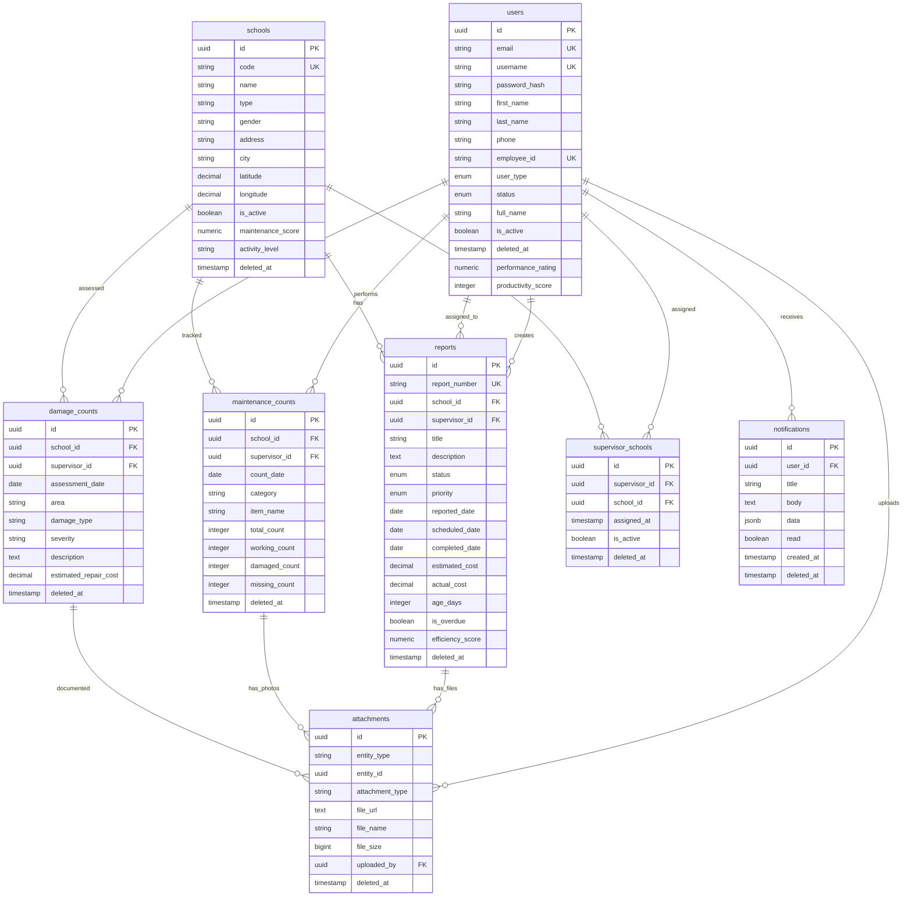

## 2. User Management Domain Diagram

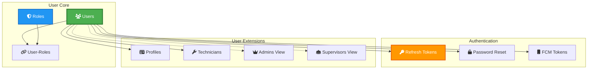

## 3. School Management Hierarchy

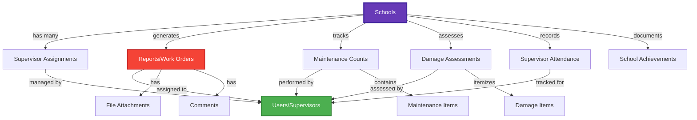

## 4. Report Lifecycle Flow Diagram

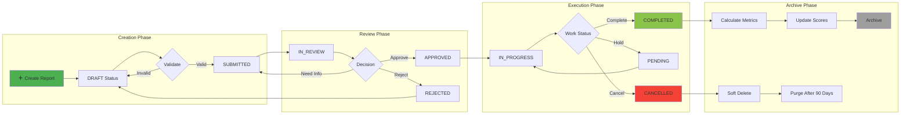

## 5. Data Partitioning Strategy

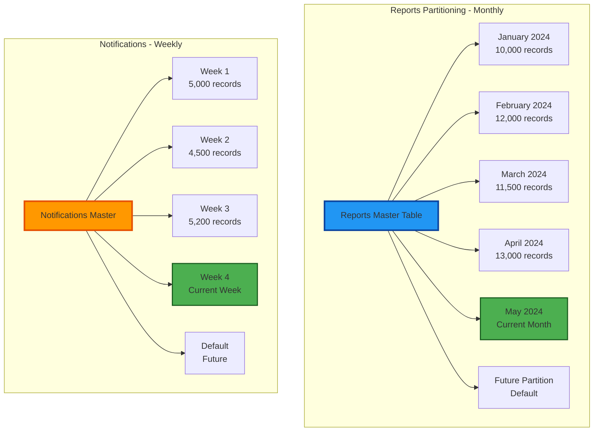

## 6. Audit System Architecture

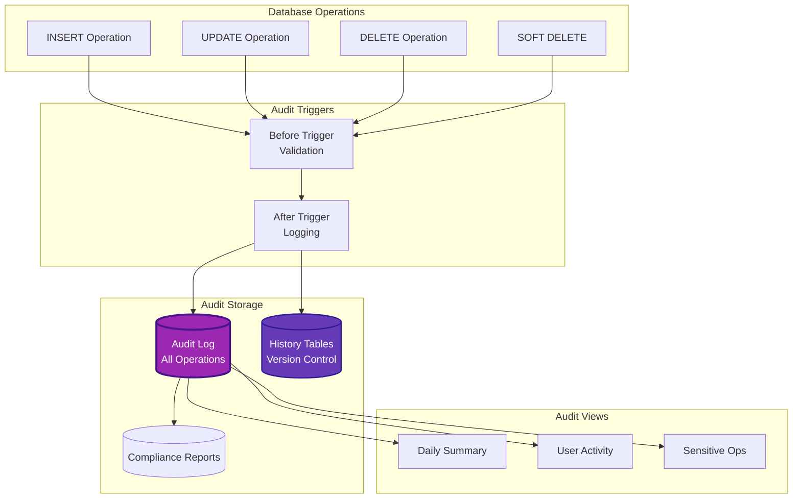

## 7. Performance Optimization Layers

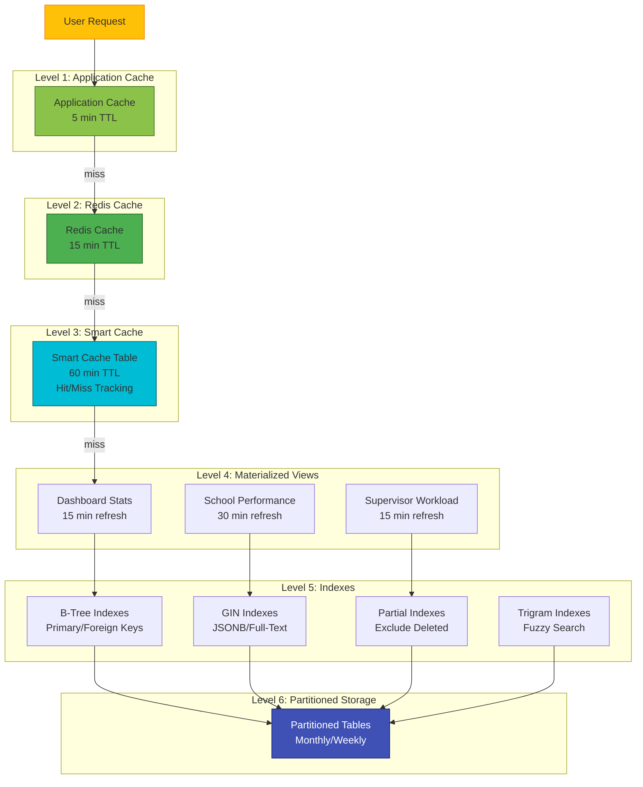

## 8. Soft Delete and Recovery Flow

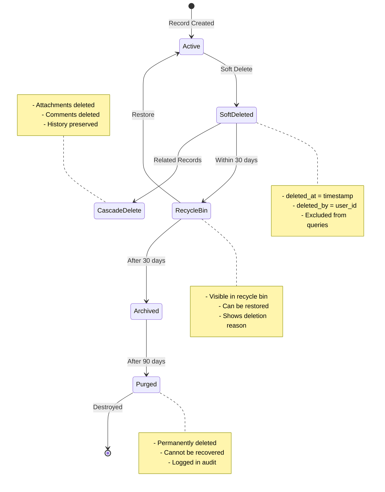

## 9. Search System Architecture

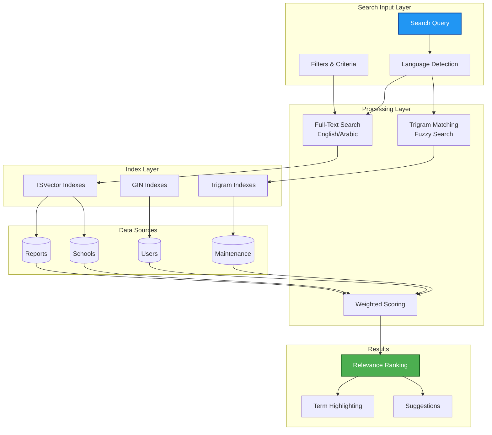

## 10. Analytics and Reporting Pipeline

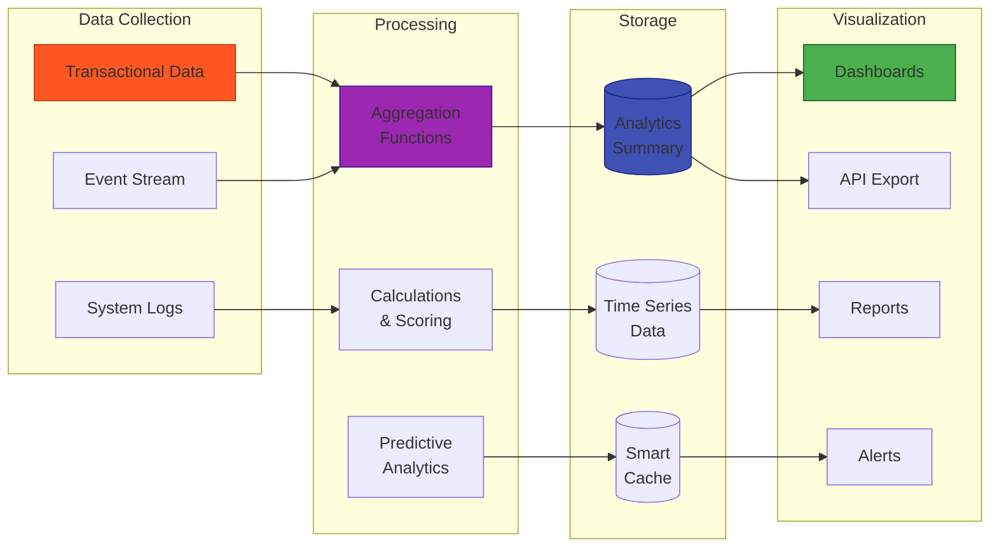

## 11. Database Security Layers

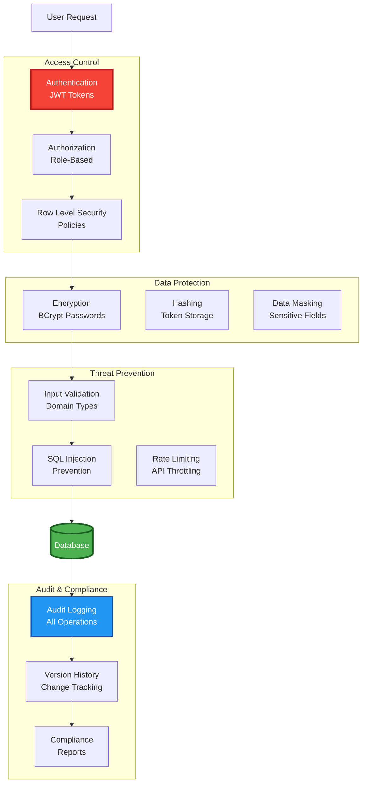

## 12. Complete System Integration View

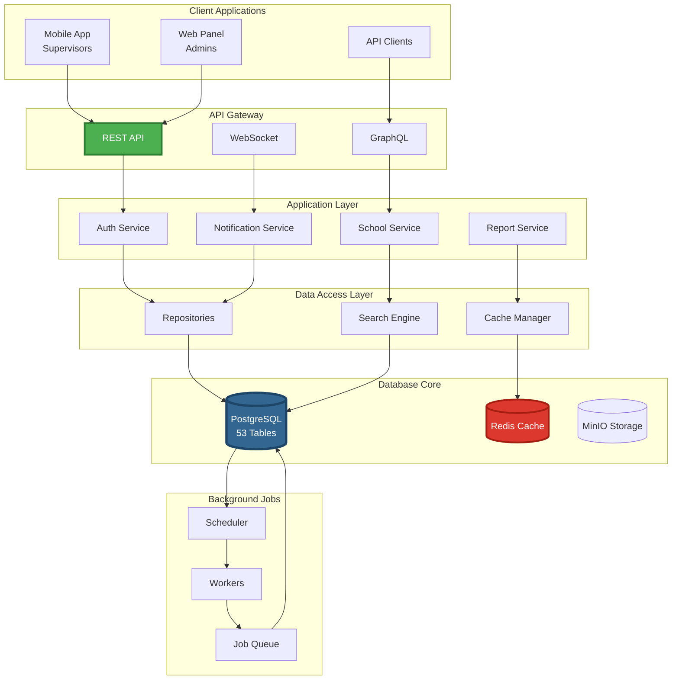

## Database Statistics Summary

| Category | Count | Description |
|----------|-------|-------------|
| **Core Tables** | 38 | Business entity tables |
| **System Tables** | 15 | Audit, cache, analytics |
| **Views** | 15+ | Active records, summaries |
| **Materialized Views** | 6 | Performance optimization |
| **Functions** | 50+ | Business logic, utilities |
| **Triggers** | 30+ | Automation, validation |
| **Indexes** | 100+ | Performance optimization |
| **Constraints** | 150+ | Data integrity |
| **Partitions** | 24+ | Monthly/weekly partitions |

## Color Legend

- 🟢 **Green**: Active/Operational Components
- 🔵 **Blue**: Data Storage/Processing
- 🟣 **Purple**: Audit/Monitoring Systems
- 🟠 **Orange**: Cache/Performance Layer
- 🔴 **Red**: Security/Critical Components
- ⚫ **Gray**: Archived/Deleted Data