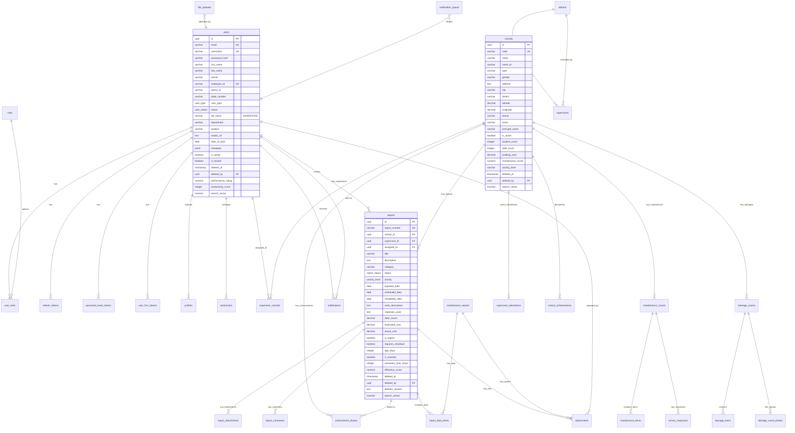
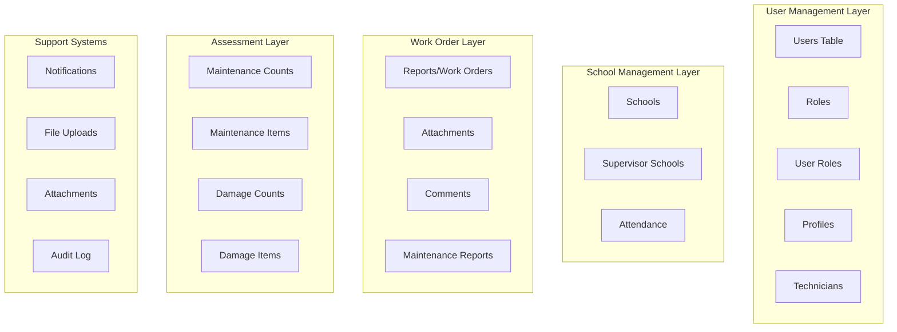
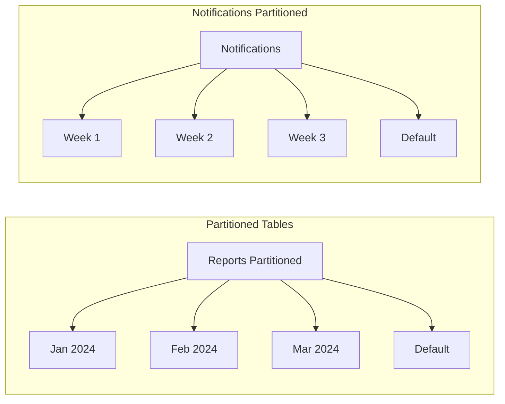
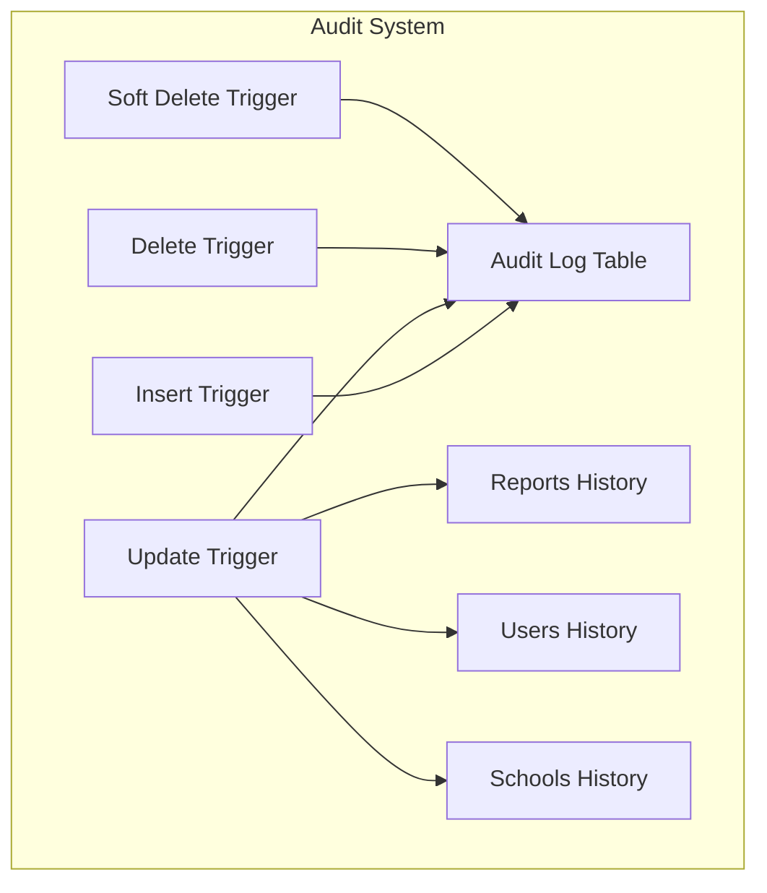
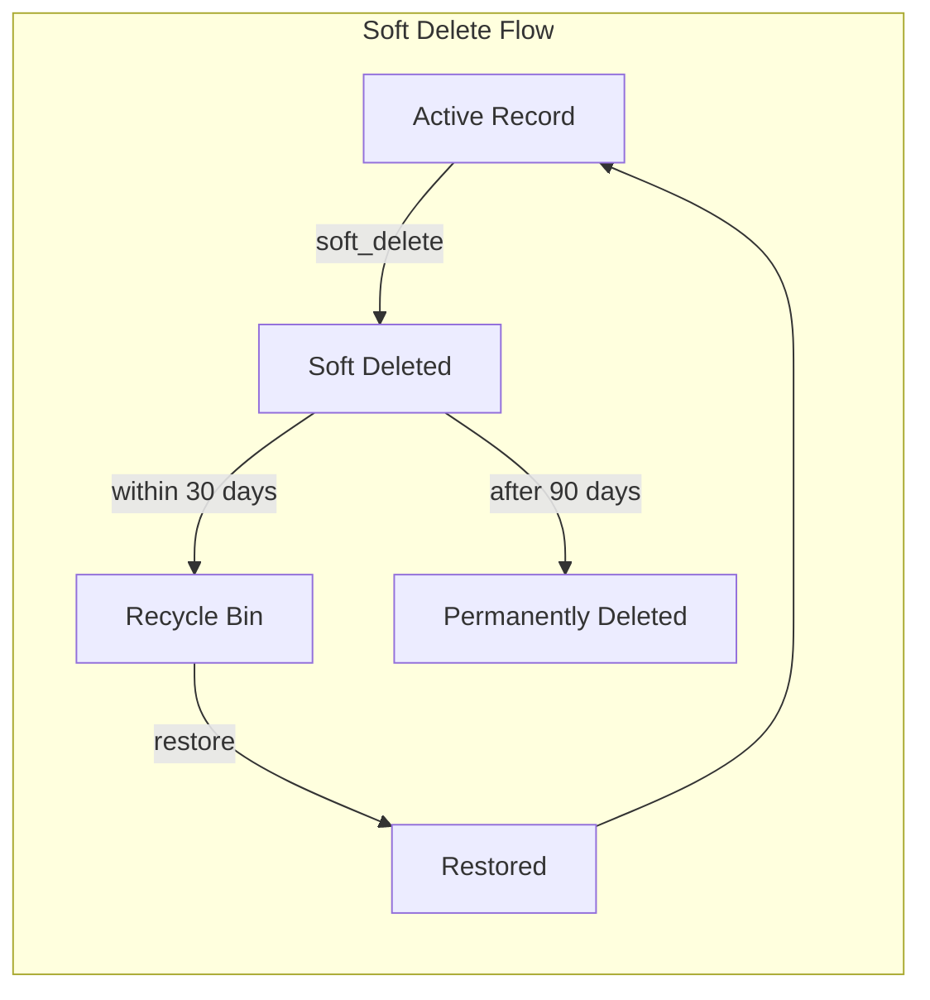

# CAFM Database Schema Documentation

## Overview
The CAFM (Computer-Aided Facility Management) database schema is designed to manage school maintenance operations with comprehensive tracking, auditing, and analytics capabilities. After 9 migration phases, the database includes advanced features like soft delete, partitioning, full-text search, and predictive analytics.

## Schema Visualization



## Database Architecture Layers

### 1. Core Tables Structure



## Key Database Features

### 1. Partitioning Strategy



### 2. Audit System Architecture



### 3. Soft Delete Implementation



## Table Categories and Relationships

### Core Entities (23 Tables)

#### 1. User Management (8 tables)
- **users** - Unified user table for all user types
- **roles** - System roles (ADMIN, SUPERVISOR, TECHNICIAN, VIEWER)
- **user_roles** - Many-to-many user-role assignments
- **profiles** - Extended user profile information
- **technicians** - Technicians managed by supervisors
- **admins** - Admin accounts (legacy, view-backed)
- **supervisors** - Supervisor accounts (legacy, view-backed)
- **refresh_tokens** - JWT refresh token storage

#### 2. School Management (3 tables)
- **schools** - Educational institutions
- **supervisor_schools** - Supervisor-school assignments
- **supervisor_attendance** - Daily attendance tracking

#### 3. Work Orders & Reports (7 tables)
- **reports** - Main work orders/maintenance reports
- **report_attachments** - File attachments for reports
- **report_comments** - Comments and notes on reports
- **maintenance_reports** - Detailed maintenance workflows
- **school_achievements** - Achievement documentation
- **achievement_photos** - Before/after documentation
- **report_data_items** - Structured report data

#### 4. Maintenance & Assessment (8 tables)
- **maintenance_counts** - Inventory and maintenance tracking
- **maintenance_items** - Individual maintenance items
- **maintenance_categories** - Item categories
- **maintenance_item_templates** - Standardized item templates
- **damage_counts** - Damage assessments
- **damage_items** - Individual damage records
- **damage_count_photos** - Damage photo documentation
- **survey_responses** - Maintenance survey responses

#### 5. File & Media Management (2 tables)
- **attachments** - Centralized file attachment system
- **file_uploads** - File upload tracking

#### 6. Notifications (4 tables)
- **notifications** - Notification history
- **notification_queue** - Pending notifications
- **user_fcm_tokens** - Push notification tokens
- **notification_rules** - Automated notification rules

### System Tables (15 Tables)

#### 7. Audit & Compliance (7 tables)
- **audit_log** - Comprehensive audit trail
- **reports_history** - Report version history
- **users_history** - User change history
- **schools_history** - School change history
- **compliance_requirements** - Compliance rules
- **compliance_reports** - Compliance audit reports
- **system_logs** - System operation logs

#### 8. Analytics & Performance (8 tables)
- **analytics_summary** - Aggregated analytics
- **time_series_data** - Time-based metrics
- **query_performance** - Query performance tracking
- **smart_cache** - Intelligent caching system
- **scheduled_reports** - Report scheduling
- **deletion_stats** - Soft delete statistics
- **data_quality_rules** - Data validation rules
- **data_quality_violations** - Validation violation logs

### Materialized Views (6 Views)
- **mv_dashboard_stats** - Dashboard statistics
- **mv_school_performance** - School performance metrics
- **mv_supervisor_workload** - Supervisor workload analysis
- **mv_school_maintenance_summary** - Maintenance summaries
- **mv_dashboard_metrics** - Real-time dashboard metrics
- **v_top_performers** - Top performing supervisors

### Active Record Views (10+ Views)
- **v_active_users** - Non-deleted active users
- **v_active_reports** - Non-deleted reports
- **v_active_schools** - Active non-deleted schools
- **v_active_supervisor_schools** - Active assignments
- **v_active_maintenance_counts** - Active maintenance records
- **v_admins** - Admin users view (backward compatibility)
- **v_supervisors** - Supervisor users view (backward compatibility)
- **v_recycle_bin** - Recently deleted items
- **v_daily_audit_summary** - Daily audit statistics
- **v_user_audit_summary** - User activity summary
- **v_sensitive_operations** - Critical operations log

## Data Types and Enums

### Custom Enums
```sql
-- User Management
user_type: 'admin', 'supervisor', 'technician', 'viewer', 'super_admin'
user_status: 'active', 'inactive', 'suspended', 'pending_verification'

-- Report Management
report_status: 'DRAFT', 'SUBMITTED', 'IN_REVIEW', 'APPROVED', 'IN_PROGRESS', 
               'COMPLETED', 'REJECTED', 'CANCELLED', 'pending', 'in_progress', 
               'completed', 'late', 'late_completed', 'cancelled'

priority_level: 'LOW', 'MEDIUM', 'HIGH', 'CRITICAL'
```

### Custom Domains
```sql
email_address: VARCHAR(255) with email validation
phone_number: VARCHAR(20) with phone validation
iqama_number: VARCHAR(50) with IQAMA validation
percentage: INTEGER (0-100)
positive_decimal: DECIMAL >= 0
year_value: INTEGER (2020-2100)
month_value: INTEGER (1-12)
rating_score: INTEGER (1-5)
```

## Key Features Implementation

### 1. Full-Text Search
- Trigram indexes for fuzzy search
- Multi-language support (Arabic/English)
- Global search across entities
- Weighted search vectors

### 2. Soft Delete Pattern
- All major tables have soft delete
- Cascade soft delete for related records
- Recycle bin functionality
- Automatic purge after 90 days

### 3. Audit System
- Complete audit trail for all operations
- Version history for critical entities
- Compliance reporting
- Sensitive operation tracking

### 4. Performance Optimizations
- Table partitioning (monthly for reports, weekly for notifications)
- Materialized views for dashboards
- Smart caching with TTL
- Query performance tracking

### 5. Advanced Analytics
- Predictive maintenance algorithms
- Performance scoring system
- Time series data storage
- Real-time dashboard metrics

### 6. Data Integrity
- Check constraints on all tables
- Exclusion constraints for overlapping data
- Domain types for validation
- Referential integrity with cascades

## Index Strategy

### Primary Indexes
- All primary keys (UUID)
- All foreign keys
- Unique constraints

### Performance Indexes
- Partial indexes excluding soft-deleted records
- Composite indexes for common query patterns
- GIN indexes for JSONB fields
- GiST indexes for full-text search
- Trigram indexes for fuzzy search

### Specialized Indexes
- Temporal indexes for date-based queries
- Exclusion indexes for preventing overlaps
- Expression indexes for computed fields

## Security Features

1. **Row-Level Security**: Prepared for RLS policies
2. **Audit Logging**: All data changes tracked
3. **Soft Delete**: Data retention for compliance
4. **Encrypted Storage**: Password hashes using BCrypt
5. **Token Management**: Secure refresh token system

## Scalability Considerations

1. **Partitioning**: Reports and notifications partitioned by date
2. **Archiving**: Automatic archival of old audit logs
3. **Caching**: Multi-level caching strategy
4. **Materialized Views**: Pre-computed aggregates
5. **Async Processing**: Queue-based notification system

## Maintenance Procedures

### Automated Tasks
- Partition creation (monthly/weekly)
- Materialized view refresh
- Cache cleanup
- Audit log archival
- Soft-deleted record purging

### Monitoring
- Query performance tracking
- Cache hit/miss ratios
- Deletion statistics
- Data quality violations
- System logs

## Migration History

1. **V1**: Initial schema with core tables
2. **V2**: Supabase compatibility updates
3. **V3**: Unified user management
4. **V4**: JSONB normalization
5. **V5**: Performance optimizations
6. **V6**: Data integrity improvements
7. **V7**: Comprehensive audit system
8. **V8**: Soft delete implementation
9. **V9**: Advanced features (search, analytics, caching)

## Database Size Estimation

### Table Growth Patterns
- **Reports**: ~1000-5000 records/month
- **Audit Log**: ~10000-50000 records/month
- **Notifications**: ~5000-20000 records/month
- **Attachments**: ~2000-10000 files/month

### Storage Requirements
- Initial: ~1-5 GB
- 1 Year: ~20-50 GB
- 3 Years: ~100-200 GB

### Performance Targets
- Query response: < 100ms for indexed queries
- Dashboard load: < 500ms with materialized views
- Search results: < 200ms with full-text search
- Bulk operations: Partitioned for parallel processing