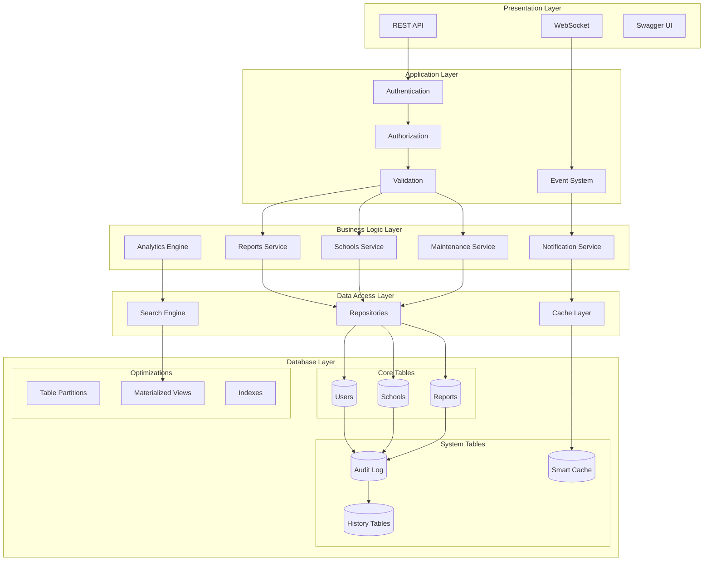
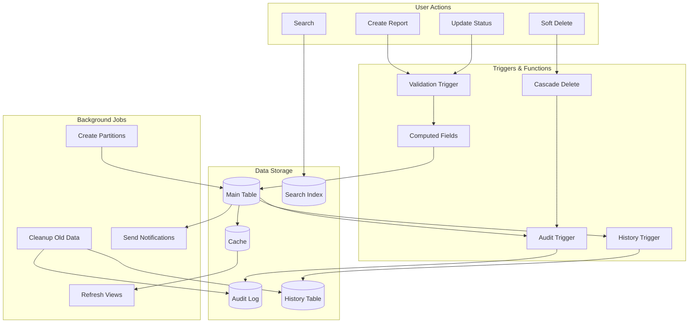
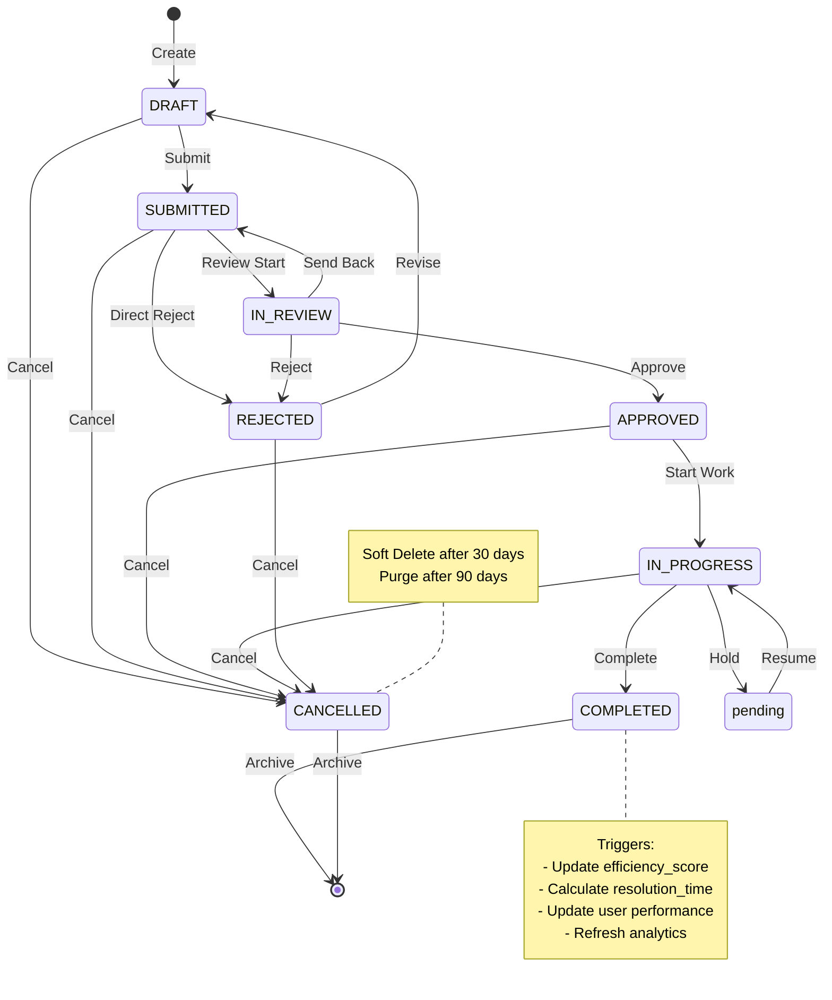
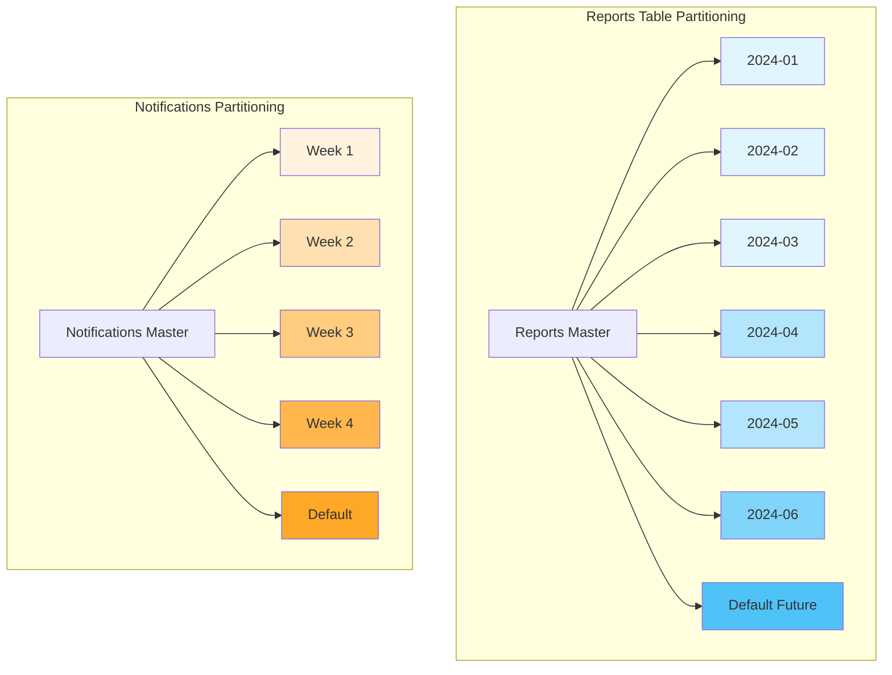
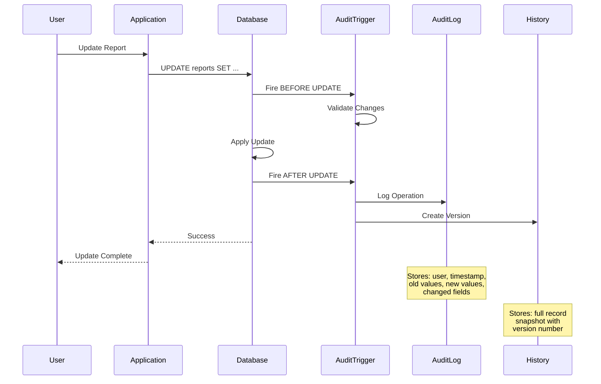
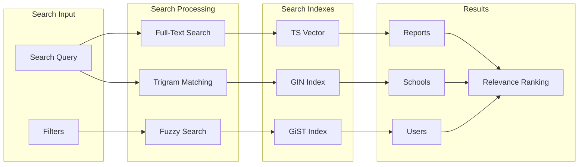
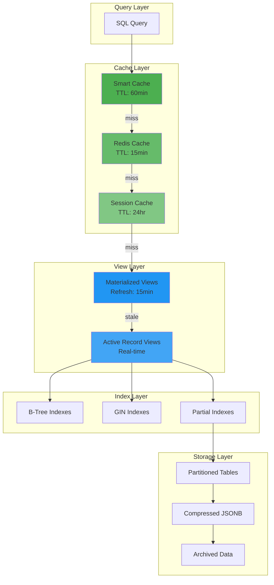
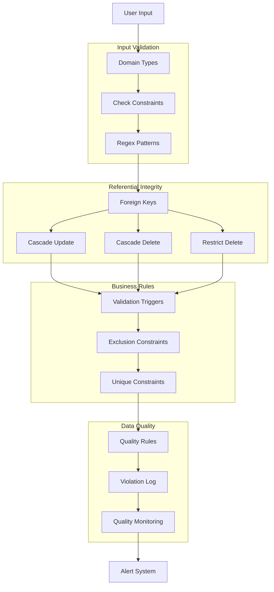
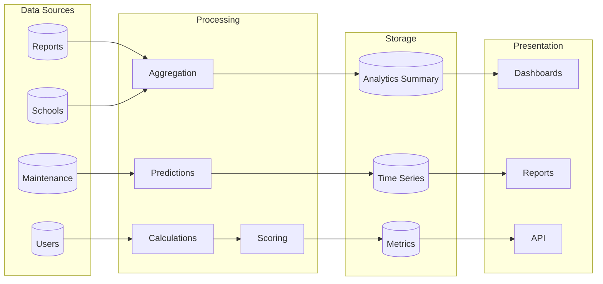

# CAFM Database Visual Diagrams

## Complete Entity Relationship Diagram

```mermaid
erDiagram
    %% ===== USER MANAGEMENT DOMAIN =====
    users ||--o{ user_roles : "has roles"
    roles ||--o{ user_roles : "assigned to"
    users ||--o{ profiles : "has profile"
    users ||--o{ refresh_tokens : "authenticates with"
    users ||--o{ password_reset_tokens : "requests reset"
    users ||--o{ user_fcm_tokens : "receives notifications"
    users ||--o{ technicians : "supervises"
    users ||--o{ notifications : "receives"
    users ||--o{ notification_queue : "queued for"
    
    %% ===== SCHOOL DOMAIN =====
    schools ||--o{ supervisor_schools : "has supervisors"
    users ||--o{ supervisor_schools : "assigned to schools"
    schools ||--o{ supervisor_attendance : "tracks attendance"
    schools ||--o{ school_achievements : "has achievements"
    
    %% ===== REPORTS/WORK ORDERS DOMAIN =====
    schools ||--o{ reports : "generates"
    users ||--o{ reports : "creates/assigned"
    reports ||--o{ report_attachments : "has attachments"
    reports ||--o{ report_comments : "has comments"
    reports ||--o{ achievement_photos : "documented in"
    reports ||--o{ report_data_items : "contains data"
    
    %% ===== MAINTENANCE DOMAIN =====
    schools ||--o{ maintenance_counts : "has counts"
    users ||--o{ maintenance_counts : "performs"
    maintenance_counts ||--o{ maintenance_items : "contains items"
    maintenance_counts ||--o{ survey_responses : "has responses"
    maintenance_categories ||--o{ maintenance_item_templates : "categorizes"
    maintenance_item_templates ||--o{ maintenance_items : "based on"
    
    schools ||--o{ maintenance_reports : "has reports"
    users ||--o{ maintenance_reports : "creates"
    maintenance_reports ||--o{ report_data_items : "contains data"
    
    %% ===== DAMAGE ASSESSMENT DOMAIN =====
    schools ||--o{ damage_counts : "assessed for"
    users ||--o{ damage_counts : "assesses"
    damage_counts ||--o{ damage_items : "itemizes"
    damage_counts ||--o{ damage_count_photos : "documents"
    
    %% ===== FILE MANAGEMENT DOMAIN =====
    attachments ||--o{ reports : "attached to"
    attachments ||--o{ maintenance_reports : "attached to"
    attachments ||--o{ school_achievements : "attached to"
    users ||--o{ attachments : "uploads"
    users ||--o{ file_uploads : "uploads"
    
    %% ===== ADMIN LEGACY DOMAIN =====
    admins ||--o{ supervisors : "manages"
    supervisors ||--o{ users : "legacy link"
```

## System Architecture Layers

## Data Flow Diagram

## Report Lifecycle State Diagram

## Partitioning Strategy Visualization

## Audit System Flow

## Search System Architecture

## Performance Optimization Layers

## Data Integrity Enforcement

## Analytics Pipeline

## Summary Statistics

### Total Database Objects
- **Core Tables**: 38
- **System Tables**: 15
- **Materialized Views**: 6
- **Regular Views**: 15+
- **Functions**: 50+
- **Triggers**: 30+
- **Indexes**: 100+
- **Constraints**: 150+

### Key Metrics
- **Partitions**: Monthly (Reports), Weekly (Notifications)
- **Audit Retention**: 90 days (then archived)
- **Soft Delete Retention**: 30 days (recycle bin), 90 days (purge)
- **Cache TTL**: 15-60 minutes depending on data type
- **View Refresh**: 15 minutes for materialized views
- **Search Languages**: English, Arabic
- **Performance Target**: <100ms for indexed queries